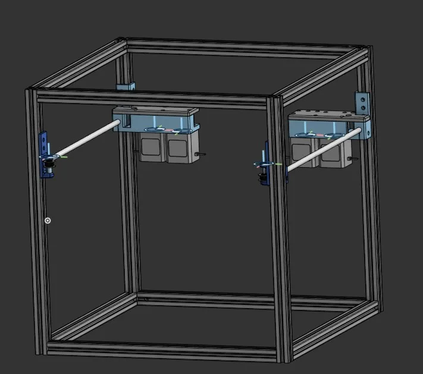
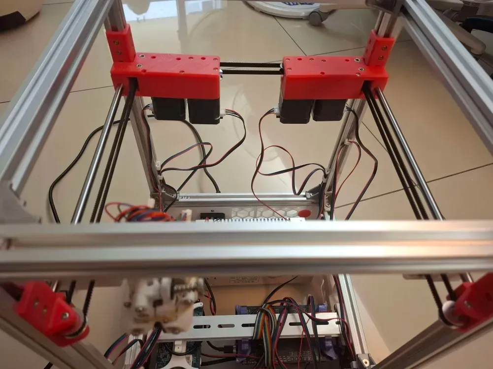

# DynamicCube

Over the years, I’ve been using 3D printers designed by others. They worked, sure, but they were never mine. This time, I wanted something different. Something personal.

From my previous AWD design experience, one flaw stood out: poor gear meshing. At high acceleration, the gears would slip and lose steps—like a machine running on too much caffeine and no breakfast. But I didn’t stop there. I wanted more print space and better performance. By shifting the motors backward, I realized I could save at least half the motor’s width in usable space. That means a larger print area and more design flexibility—exactly what I was aiming for.So I redesigned the AWD module, improved torque transmission, and even expanded the toolhead’s travel space. This upgrade is pure gain: no compromises, just improvements. The only downside? Assembly might make you question your life choices.

## Project status
- ❗fully enclosed
- ✅Change motor to make more trivial space (XY AWD V2)
- ❗Using trident hotbed thus the printer will have autobed feature.
- ❗Skirt

## Project Specifications
- 2020 aluminum extrusion
- 8mm linear rods
- Mini Stealth toolhead
- Shortened linear rods (Using lm8uu not lm8luu)
    
## Current Setup my build:
- 250mm*250mm hotbed size
- 250mm*280mm travel size (you can add nozzle cleaner or other removeable probe)
- 420mm*420mm Frame size

## License

This work is licensed under a Creative Commons (4.0 International License)

Attribution-ShareAlike

- ✖ | Sharing without ATTRIBUTION
- ✔ | Remix Culture allowed
- ✔ | Commercial Use
- ✔ | Free Cultural Works
- ✔ | Meets Open Definition 
